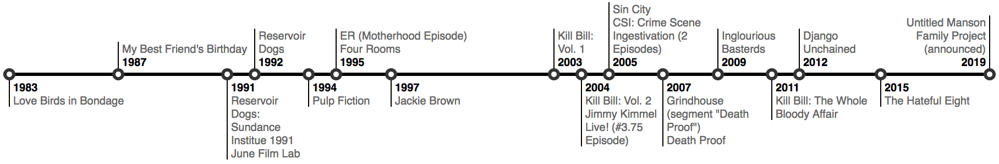

[](https://badge.fury.io/js/d3-milestones)

# milestones

A d3 based timeline visualization.



## Installing

To use it via NPM, use `npm install d3-milestones`. 

The most quick way to get going is to use `unpkg.com` as a CDN to include the library directly into your HTML file.

```html
<link rel="stylesheet" href="https://unpkg.com/d3-milestones@1.0.0-alpha7/build/d3-milestones.css">
<script src="https://unpkg.com/d3-milestones@1.0.0-alpha7/build/d3-milestones.min.js"></script>

<div id="timeline"></div>

<script>
  milestones('#timeline')
    .mapping({
      'timestamp': 'year',
      'text': 'title'
    })
    .parseTime('%Y')
    .aggregateBy('year')
    .render([
      { year: 1983, title: 'Love Birds in Bondage' },
      { year: 1987, title: 'My Best Friend\'s Birthday' },
      ...
      { year: 2015, title: 'The Hateful Eight' },
      { year: 2019, title: 'Untitled Manson Family Project (announced)' }
    ]);
</script>
```

Head over here to see this example in action: https://bl.ocks.org/walterra/385f914c4f38e42fab740860ca22db16.

## Examples

There are more examples included in the github repository. These examples should give you an idea how to work with the library. 

- clone the repository and from within its directory run the following commands:
- `npm install` should fetch all required dependencies and create the build files.
- `npm start` spins up a web server. It will output the host/ip you should head your browser to, e.g.:
  - http://localhost:8080/example/milestones.html
  - http://localhost:8080/example/tarantino.html
  - http://localhost:8080/example/tarantino-rodriguez.html
